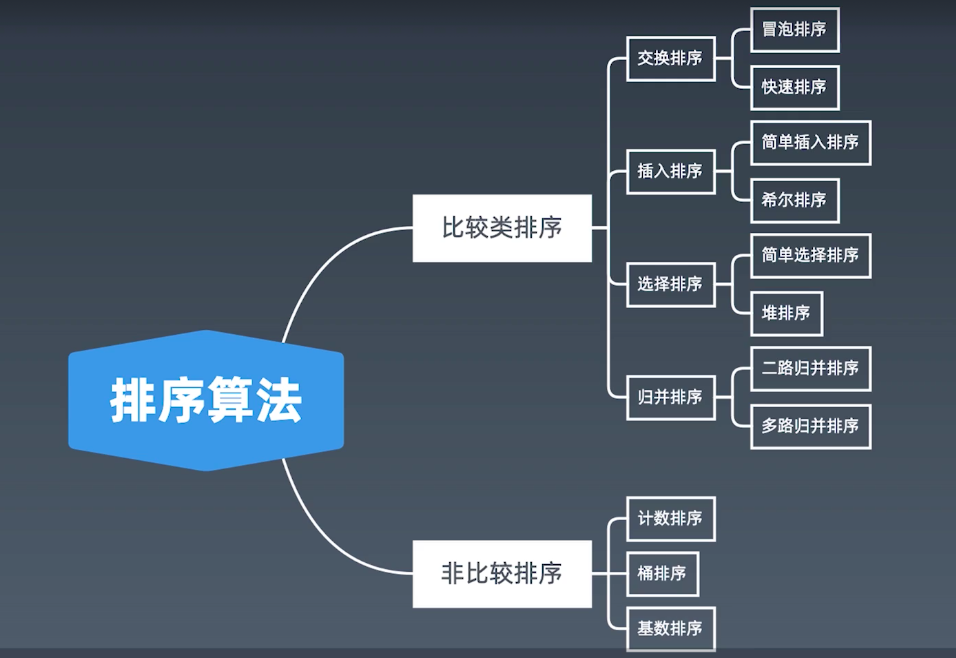

学习笔记
## 布隆过滤器Bloom Filter
一个很长的二进制向量和一系列随机映射函数。

布隆过滤器可以用于检索一个元素是否在一个集合中

优点是空间效率和查询时间（模糊查询）都远远超过一般的算法

缺点是有一定的误识别率和删除困难

示意图


布隆过滤器查到元素不在list中，那么就一定不在，但是查到元素c在list中，则不一定在，如下图所示


新元素经过映射函数转为二进制向量后，可能它的每一位刚好与其它多个元素提供的部分全匹配了，此时可以去实际数据list中通过其它算法再次检索

使用案例：
1. 比特币网络；
2. 分布式系统（Map-Reduce）；
3. Redis缓存；
4. 垃圾邮件、评论等的过滤；

## LruCache
最近最少使用的则被淘汰，两个要素：大小、替换策略

实现：HashTable + Double LinkedList

查询，修改，更新均为O（1）


## 排序


 快速排序
```
public static void quickSort(int[] array, int begin, int end) {
    if (end <= begin) return;
    int pivot = partition(array, begin, end);
    quickSort(array, begin, pivot - 1);
    quickSort(array, pivot + 1, end);
}

private static int partition(int[] a, int begin, int end) {
    // pivot: 标杆位置，counter: 小于pivot的元素的个数
    int pivot = end, counter = begin;
    for (int i = begin; i < end; i++) {
        if (a[i] < a[pivot]) {
            int temp = a[counter];
            a[counter] = a[i];
            a[i] = temp;
            counter++;
        }
    }
    int temp = a[pivot];
    a[pivot] = a[counter];
    a[counter] = temp;
    return counter;
}
```

归并排序
```
public static void mergeSort(int[] array, int left, int right) {
    if (right <= left) return;
    int mid = (left + right) >> 1;
    mergeSort(array, left, mid);
    mergeSort(array, mid + 1, right);
    merge(array, left, mid, right);
}

private static void merge(int[] arr, int left, int mid, int right) {
    int[] temp = new int[right - left + 1];
    int i = left, j = mid + 1, k = 0;
    
    while (i <= mid && j <= right) {
        temp[k++] = arr[i] <= arr[j] ? arr[i++] : arr[j++];
    }
    
    while (j <= mid) temp[k++] = arr[j++];
    while (j <= right) temp[k++] = arr[j++];
    
    for (int p = 0; p < temp.length; p++) {
        arr[left + p] = temp[p];
    }
}
```

堆排序: O(N * LogN):  堆插入O(logN)，取最大/最小值O(1)
1. 数组元素依次建立小顶堆；
2. 依次取堆顶元素，并删除


